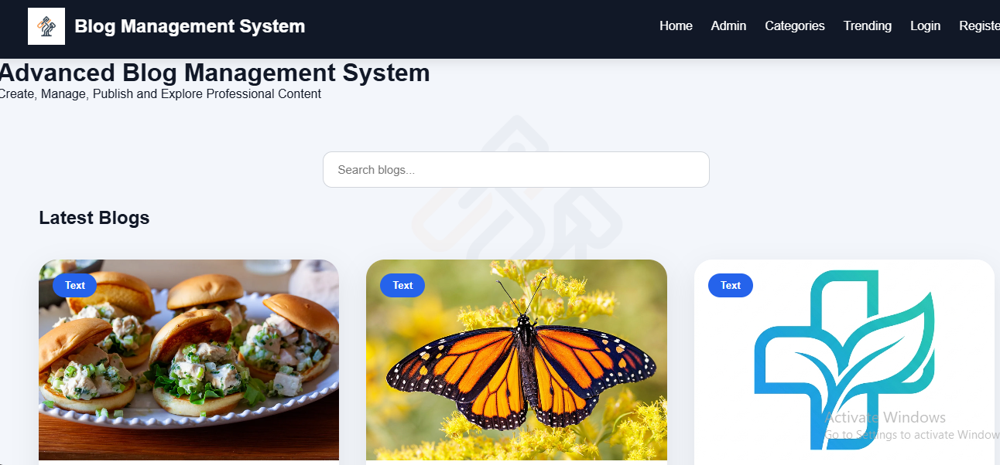
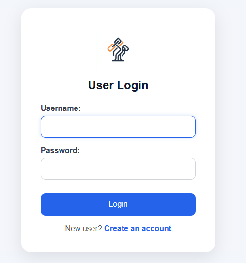
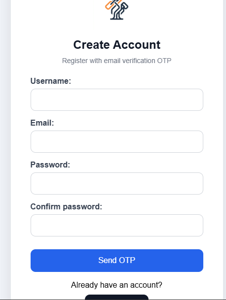
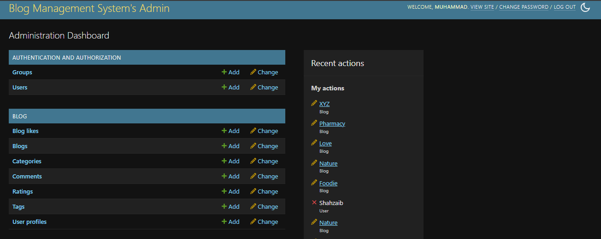

# 📝 Blog Management System (Django)

A modern Blog Management System built with Django that allows users to register, publish blogs, interact through comments and ratings, and manage their profiles. The system includes OTP email verification, authentication, blog categories, tags, likes, and an admin dashboard.

---

## 📌 Features

### 👤 User Features
- User Registration & Login
- OTP Email Verification
- User Profile Management
- Change Profile Picture
- Secure Authentication

### 📝 Blog Features
- Create Blog Posts
- Edit & Delete Own Blogs
- Featured Blogs
- Trending Blogs
- Blog Categories
- Blog Tags
- Search Blogs
- View Blog Details

### 💬 Interaction Features
- Like Blogs
- Comment on Blogs
- Rate Blogs (1–5 Stars)
- Average Rating Display

### 🔐 Admin Features
- Manage Users
- Manage Blogs
- Manage Categories
- Manage Tags
- Approve Comments
- View Ratings
- Dashboard Management

---

## 🛠️ Technologies Used

- Python 3
- Django 6
- SQLite3
- HTML5
- CSS3
- JavaScript
- Bootstrap 5
- Pillow

---

## 📂 Project Structure

```
Blog-Management-System-Django/
│
├── blog/
├── myblog/
├── media/
├── blog_images/
├── manage.py
├── requirements.txt
├── README.md
├── LICENSE
└── .gitignore
```

---

## 🚀 Installation

### Clone the repository

```bash
git clone https://github.com/Muhammad-Shahzaib8/Blog-Management-System-Django.git
```

### Navigate to the project

```bash
cd Blog-Management-System-Django
```

### Create a virtual environment

```bash
python -m venv venv
```

### Activate virtual environment

**Windows**

```bash
venv\Scripts\activate
```

**Linux / macOS**

```bash
source venv/bin/activate
```

### Install dependencies

```bash
pip install -r requirements.txt
```

### Apply migrations

```bash
python manage.py migrate
```

### Run the server

```bash
python manage.py runserver
```

Visit:

```
http://127.0.0.1:8000/
```

---

## 📸 Screenshots


### Home Page



### Login Page



### Register Page



### Blog Details


### Admin Dashboard


---

## 🌟 Future Improvements

- Bookmark Blogs
- Dark Mode
- Rich Text Editor
- AI Blog Assistant
- Blog Recommendation System
- Email Notifications
- REST API
- Social Login
- User Following System

---

## 👨‍💻 Author

**Muhammad Shahzaib**

GitHub:
https://github.com/Muhammad-Shahzaib8

---

## 📄 License

This project is licensed under the MIT License.

---

## ⭐ Support

If you found this project useful, please consider giving it a ⭐ on GitHub.